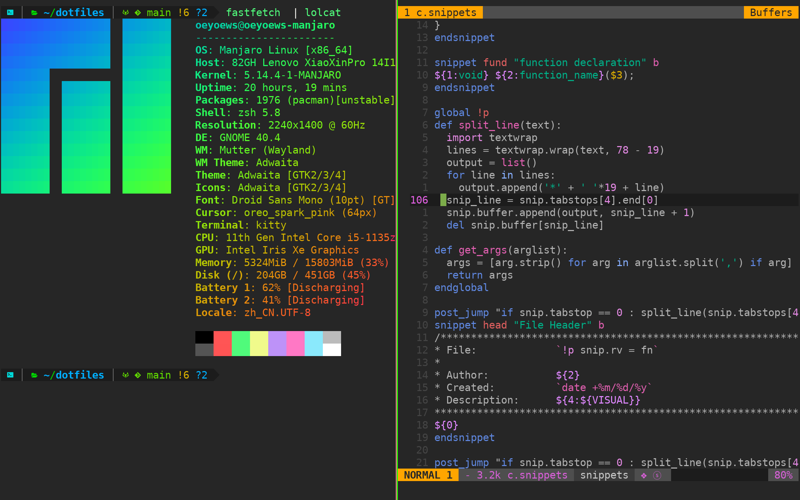

<!-- vim-markdown-toc Marked -->

- [Dependencies](#dependencies)
- [Installation](#installation)
- [NOTE](#note)
- [Configuration](#configuration)
  - [examples](#examples)

<!-- vim-markdown-toc -->



<details>Environment<details>

- **Terminal**: kitty(extra: alacritty, tmux) 
- **Shell** : zsh
- **Editor**: vscode, vim(:SpaceVim), emacs(Doomemacs, Spacemacs), typora
- **Font:** Droid Sans Mono, DejaVu Sans Mono
- **Input:** fcitx5
- **Linux:**  mangaro gdm gnome40
- **Networktools:** qv2ray, v2raya(kernel: v2ray)
- **Misc:** cheat, crontab

Dependencies
---

- stow: my all dotfiles directory is fit for stow

Installation
---
```zsh
# gitlab
git clone --depth=1  https://gitlab.com/oeyoews/dotfiles.git ~
```

```zsh
# or use github(mirror from gitlab)
git clone --depth=1  https://github.com/oeyoews/dotfiles.git ~
```

```zsh
# or use gitee(mirror from gitlab)
git clone --depth=1  https://gitee.com/oeyoews/dotfiles.git ~
```

NOTE
---

- this last reposonity location in your directory  must be like this : ~/dotfiles

Configuration
-

### examples
```zsh
  # omz(improve version for oh-my-zsh)
  cd ~/dotfiles
  stow omz
```

```zsh 
# other configure in ~/dotfiles/archive
  cd ~/dotfiles/archive
  stow -t ~ ideavimrc
```
