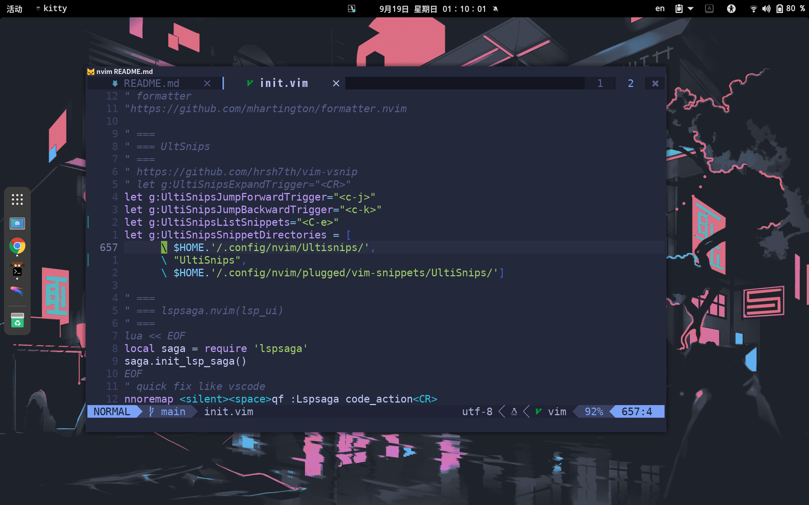

<!-- vim-markdown-toc Marked -->

* [Env](#env)
* [Features](#features)
* [Installation](#installation)
* [Caveats](#caveats)
* [Configuration](#configuration)

<!-- vim-markdown-toc -->



## Env

| Linux   | Terminal | Shell | Font  | Editor |
|---------|----------|-------|-------|--------|
| gnome40 | kitty    | zsh   | Droid | neovim |

## Features 
- [ ] todo

## Installation

```zsh
# gitlab
git clone --depth=1  https://gitlab.com/oeyoews/dotfiles.git ~
```

```zsh
# or use github(mirror from gitlab)
git clone --depth=1  https://github.com/oeyoews/dotfiles.git ~
```

```zsh
# or use gitee(mirror from gitlab)
git clone --depth=1  https://gitee.com/oeyoews/dotfiles.git ~
```

## Caveats

```text
1. Stow: my all dotfiles directory is fit for stow

2. this last reposonity location in your directory  must be like this : ~/dotfiles
```

## Configuration

```zsh
  # omz(improve version for oh-my-zsh)
  cd ~/dotfiles
  stow omz
```

```zsh 
# other configure in ~/dotfiles/archive
  cd ~/dotfiles/archive
  stow -t ~ tiny_vimrc
```
