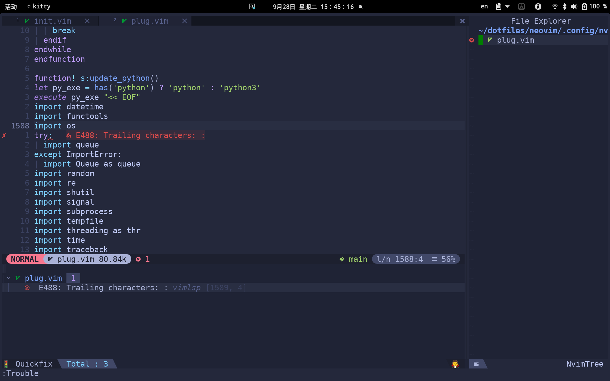
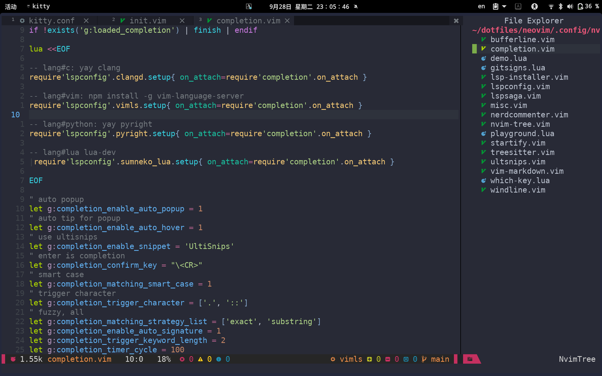

<!-- vim-markdown-toc Marked -->

* [Env](#env)
* [Features](#features)
* [Installation](#installation)
* [Caveats](#caveats)
* [Configuration](#configuration)

<!-- vim-markdown-toc -->

 

## Env

| Linux   | Terminal | Shell | Font  | Editor        |
|---------|----------|-------|-------|---------------|
| gnome40 | kitty    | zsh   | Droid | neovim(0.5.1) |

## Features 


## Installation

```sh
# gitlab
git clone --depth=1  https://gitlab.com/oeyoews/dotfiles.git ~
```

## Caveats

- management tool: stow

## Configuration
