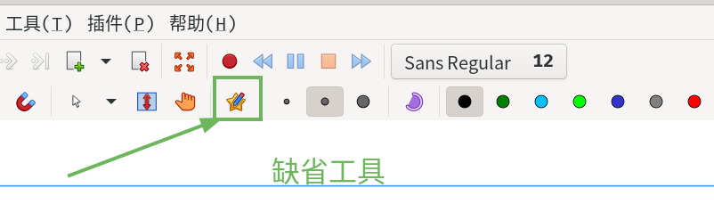

- xournal: 点击缺省工具 

- scp lighthouse@101.43.122.185:/home/lighthouse/testscp.md .
- rsync lighthouse@101.43.122.185:/home/lighthouse/testscp.md 1/
  - need password

### gnome-keyring
  - 由于密码管理， 很多依赖于gnome-keyring(or kwallet), 如果是自动登陆， 则需要输入密码为gnome-keyring
  - [link](https://wiki.archlinux.org/title/GNOME_(%E7%AE%80%E4%BD%93%E4%B8%AD%E6%96%87)/Keyring_(%E7%AE%80%E4%BD%93%E4%B8%AD%E6%96%87))
  - current-passwd: 2956
  - uname -a

  - 不建议升级idea版本（include android-studio)

  - ctrl + alt + F4 : enter tty

